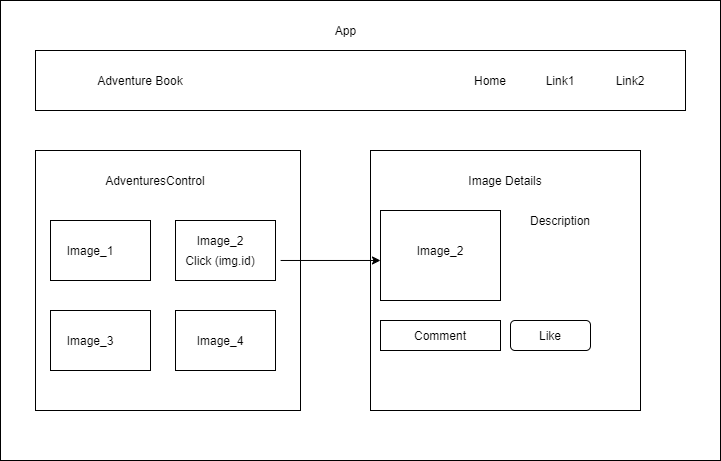

# Adventure Book 
### Capstone project at Epicodus
#### By: Nitun Datta
_July 17, 2020_

## Description

### Adventure lovers can share their outdoor activity pictures and stories on this website. So other users can view  their pictures and learn about places and activities. Users can comment and like the picture.
### Advertising partners can post add on their outdoor gears, clothes, bag, tent, etc. with product URL and details. When a user will post a picture, they can tag all the outdoor gears or other stuff in the picture. If other user clicks on those tag items, they will be redirected to the product website. For each click user who posted that picture will earn a commission for flowing traffic to the product site.

## Component Tree

### Website Template

## Demo Video
  * https://www.youtube.com/watch?v=HrF3ozj_MVw

## Setup/Installation Requirements

* Clone this repository from GitHub.
* Ensure that Node is installed on your computer
* In the project directory, run the 'npm install' command.
* run 'npm start'

### Backend Restful Services follow the GitHub repo
https://github.com/nitundatta8/capstone-adventurebook.git

## Specification
  * Users can post pictures and tag items on the picture.
  * Advertisers can post add to the website.
  * Show earning reports to the user.
  * Show traffic flow reports to advertisers.

### Known Bugs

### No bugs have been identified at the time of this update.

## Support and Contact Information

### Please contact me with any suggestions or questions at nitun.2@gmail.com. Thank you for your input!  
  
## Technologies Used
  * Git
  * React
  * Javascript
  * npm
  * Webpack
  * JSX
  * Html
  * CSS
  
  ## Future Plan
    * Add some image filtering similar to Instagram.
    * Integrate affiliate partner API like “Avantlink” for affiliate advertisement.

### License
### This software is licensed under the MIT license.

### Copyright (c) 2020 Nitun Datta
